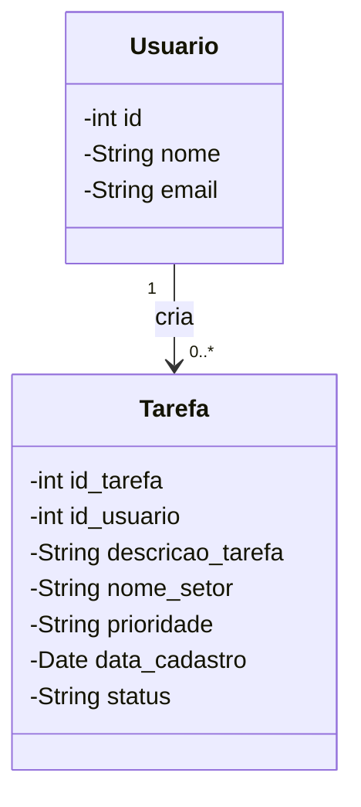

# Diagrama de Classes


# Script Banco de Dados
```
-- Criar a tabela usuarios
CREATE TABLE usuarios (
    id SERIAL PRIMARY KEY,
    nome VARCHAR(100) NOT NULL,
    email VARCHAR(100) UNIQUE NOT NULL
);

-- Criar a tabela tarefas
CREATE TABLE tarefas (
    id_tarefa SERIAL PRIMARY KEY,
    id_usuario INT REFERENCES usuarios(id) ON DELETE CASCADE,
    descricao_tarefa TEXT NOT NULL,
    nome_setor VARCHAR(50) NOT NULL,
    prioridade VARCHAR(10) CHECK (prioridade IN ('baixa', 'media', 'alta')),
    data_cadastro TIMESTAMP DEFAULT CURRENT_TIMESTAMP,
    status VARCHAR(10) CHECK (status IN ('a fazer', 'fazendo', 'pronto'))
);
```
